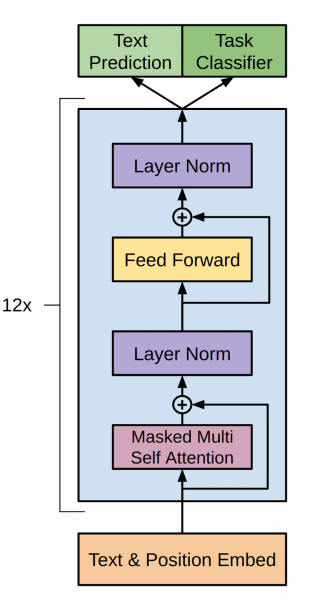

# NLP-Papers
This is my feeble attempt at reading and implementing various NLP papers. Mostly for educational purposes so.

## Table of Contents
- [Transformer](#transformer)
- [BERT](#bert)
- [GPTv1](#gptv1)
- [GPTv2](#gptv2)
- [GPTv3](#gptv3)
## Transformer (Attention is All You Need)

This implementation of the Transformer model follows the original architecture introduced by [Vaswani et al. (2017)](https://arxiv.org/abs/1706.03762), consisting of both **Encoder** and **Decoder** Blocks. Each encoder block contains a **Multi-Head Self-Attention** mechanism followed by a **Feed-Forward Neural Network**, with residual connections and layer normalization applied at each stage. The decoder blocks additionally include a **Cross-Attention** mechanism, which allows the model to attend to the encoder’s output while generating the target sequence. The model uses token and positional embeddings to represent input sequences, and causal masking is applied in the decoder to ensure autoregressive generation for sequence-to-sequence tasks such as machine translation.

<p align="center">
  
</p>


```python
import torch
from models.transformer import Transformer  # assuming you've defined GPTv2 correctly

# Define constants
SRC_VOCAB_SIZE = 1000
TGT_VOCAB_SIZE = 1000
D_MODEL = 768
NUM_LAYERS = 6
NUM_HEADS = 12
D_FF = 2048
SEQ_LEN = 64
BATCH_SIZE = 32
MAX_SEQ_LEN = 100  # Maximum sequence length for positional embeddings

# Initialize the Transformer model
model = Transformer(
    src_vocab_size=SRC_VOCAB_SIZE, 
    tgt_vocab_size=TGT_VOCAB_SIZE, 
    n_embd=D_MODEL,
    n_layer=NUM_LAYERS,
    n_head=NUM_HEADS,
    d_ff=D_FF,
    max_seq_len=MAX_SEQ_LEN
)

# Create dummy input data: random token IDs within the range [0, SRC_VOCAB_SIZE-1] and [0, TGT_VOCAB_SIZE-1]
src_dummy_data = torch.randint(0, SRC_VOCAB_SIZE, (BATCH_SIZE, SEQ_LEN))  # Source input data
tgt_dummy_data = torch.randint(0, TGT_VOCAB_SIZE, (BATCH_SIZE, SEQ_LEN))  # Target input data

# Forward pass: generate predictions
preds = model(src_dummy_data, tgt_dummy_data)

# Output predictions shape (should match batch size, sequence length, and target vocabulary size)
print(preds.shape)  # Output shape: (BATCH_SIZE, SEQ_LEN, TGT_VOCAB_SIZE)
```


## Bert 

This implementation of BERT, as introduced by Jacob Devlin et al. in their paper [BERT: Pre-training of Deep Bidirectional Transformers for Language Understanding](https://arxiv.org/abs/1810.04805), follows the original architecture, consisting of a stack of transformer-based **Encoder Blocks**. Each block contains a **Multi-Head Self-Attention** mechanism followed by a **Feed-Forward Neural Network**, both of which include residual connections and layer normalization. The model uses token, positional, and segment embeddings to handle input sequences, with masking applied for padding tokens.

<p align="center">
  
</p>


```python
import torch
from models import bert 

# Define constants
VOCAB_SIZE = 1000
D_MODEL = 768
NUM_ENCODER_BLKS = 12
NUM_HEADS = 12
SEQ_LEN = 64
DROPOUT = 0.2
BATCH_SIZE = 32 

# Initialize the BERT model
model = bert.BERT(vocab_size=VOCAB_SIZE,
                  d_model=D_MODEL,
                  num_encoder_blks=NUM_ENCODER_BLKS,
                  num_heads=NUM_HEADS,
                  seq_len=SEQ_LEN,
                  dropout=DROPOUT
                  )

# Create dummy input data: random token IDs within the range [0, VOCAB_SIZE-1]
dummy_data = torch.randint(0, VOCAB_SIZE, (BATCH_SIZE, SEQ_LEN))

# Forward pass: generate predictions
preds = model(dummy_data)

# Output predictions shape (should match batch size and sequence length)
print(preds.shape) # Output shape: (BATCH_SIZE, SEQ_LEN, D_MODEL)

```

## GPTv1
This implementation of GPT-1, as introduced by Alec Radford et al. in their paper [Improving Language Understanding by Generative Pre-Training](https://cdn.openai.com/research-covers/language-unsupervised/language_understanding_paper.pdf), follows the original architecture, consisting of a stack of transformer-based **Decoder Blocks**. Each block contains a **Masked Multi-Head Self-Attention** mechanism, followed by a **Feed-Forward Neural Network**, both of which include residual connections and layer normalization. Unlike bidirectional models, GPT-1 uses causal masking in the attention mechanism to prevent tokens from attending to future positions. The model employs token and positional embeddings to represent input sequences, and it is designed primarily for generative tasks, where each token is predicted autoregressively based on previous context.

<p align="center">
  
</p>


```python
import torch
from models import gptv1 

# Define constants
VOCAB_SIZE = 1000
SEQ_LEN = 64
BATCH_SIZE = 32 
D_MODEL = 768

# Initialize the BERT model
model = gptv1.GPTv1(vocab_size=VOCAB_SIZE,
                    n_positions=SEQ_LEN,
                    n_embd=D_MODEL
                   )

# Create dummy input data: random token IDs within the range [0, VOCAB_SIZE-1]
input_ids = torch.randint(0, VOCAB_SIZE, (BATCH_SIZE, SEQ_LEN))

preds = model(input_ids)
print(preds.shape) # Output shape: (BATCH_SIZE, SEQ_LEN, VOCAB_SIZE)
```

## GPTv2
This implementation of GPT-1, as introduced by Alec Radford et al. in their paper [Language Models are Unsupervised Multitask Learners](https://cdn.openai.com/better-language-models/language_models_are_unsupervised_multitask_learners.pdf), builds upon the architecture of GPT-1, with a similar stack of transformer-based **Decoder Blocks**. Each block contains a **Masked Multi-Head Self-Attention** mechanism and a **Feed-Forward Neural Network**, both using pre-activation layer normalization and residual connections. GPT-2 also uses causal masking in the attention mechanism to ensure that tokens can only attend to past and current positions, maintaining the autoregressive nature of the model. The input sequences are represented through learned token and positional embeddings. GPT-2 improves over GPT-1 with an increased context window, larger model size, expanded vocabulary, and more robust training, making it well-suited for a wide range of generative tasks where text is predicted one token at a time based on preceding tokens.

GPT-2: It has four different versions with varying parameter counts: 117M, 345M, 762M, and 1.5B (billion) parameters.

<p align="center">
  
</p>

```python
import torch
from models.gptv2 import GPTv2  # assuming you've defined GPTv2 correctly

# Define constants
VOCAB_SIZE = 1000
D_MODEL = 768
NUM_ENCODER_BLKS = 12
NUM_HEADS = 12
SEQ_LEN = 64
BATCH_SIZE = 32 

# Initialize the GPT model (GPTv2 in your case)
model = GPTv2(vocab_size=VOCAB_SIZE, 
              n_positions=SEQ_LEN,
              n_embd=D_MODEL,
              n_layer=NUM_ENCODER_BLKS,
              n_head=NUM_HEADS)

# Create dummy input data: random token IDs within the range [0, VOCAB_SIZE-1]
dummy_data = torch.randint(0, VOCAB_SIZE, (BATCH_SIZE, SEQ_LEN))

# Forward pass: generate predictions
preds = model(dummy_data)

# Output predictions shape (should match batch size, sequence length, and vocab size)
print(preds.shape)  # Output shape: (BATCH_SIZE, SEQ_LEN, VOCAB_SIZE)
```

## GPTv3
GPT-3 mostly follow GPT-2 architecture but with some modifications.Most notable change is the use of **Sparse Attention** in the decoder blocks.

It has four different versions with varying parameter counts: 125M, 350M, 1.3B, and 175B parameters.

<p align="center">
  
</p>

```python
import torch
from models.gptv3 import GPTv3

# Define constants
VOCAB_SIZE = 1000
SEQ_LEN = 64
BATCH_SIZE = 32 
D_MODEL = 768

# Create dummy input data: random token IDs within the range [0, VOCAB_SIZE-1]
input_ids = torch.randint(0, VOCAB_SIZE, (BATCH_SIZE, SEQ_LEN))
model = GPTv3(vocab_size=VOCAB_SIZE, 
                n_positions=SEQ_LEN, 
                d_model=D_MODEL, 
                n_layers=6, 
                n_heads=12, 
                d_ff=2048, 
                window_size=16, 
                attn_pdrop=0.1, 
                embd_pdrop=0.1, 
                resid_pdrop=0.1, 
                layer_norm_epsilon=1e-5)
logits = model(input_ids)
print(logits.shape)
  ```