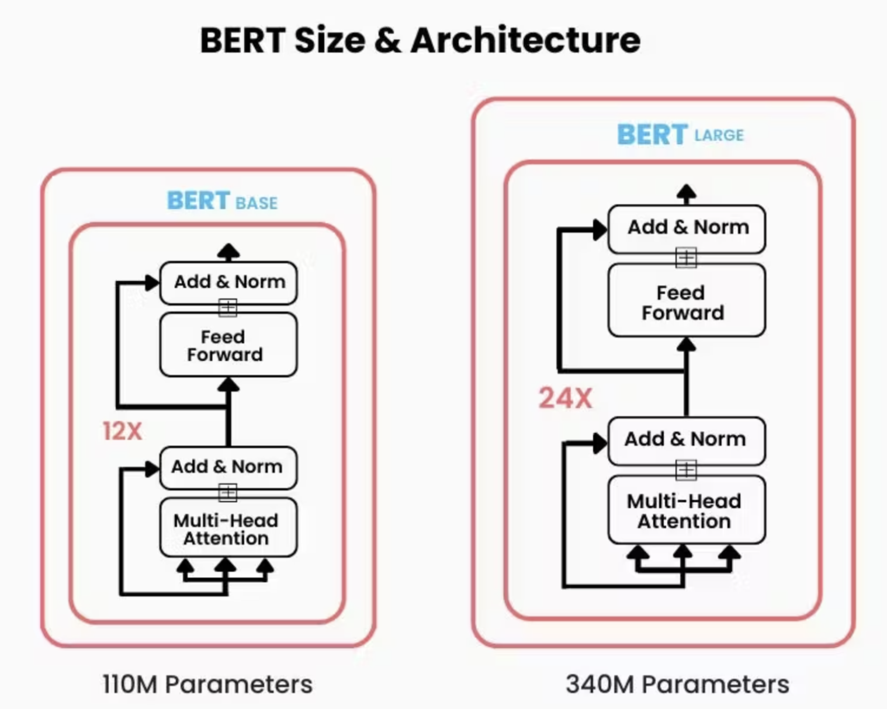

# NLP-Papers
This is my feeble attempt at reading and implementing various NLP papers. Mostly for educational purposes so.

## Table of Contents
- [BERT](#bert)
- [GPTv1](#gptv1)

## Bert 

This implementation of BERT follows the original architecture, consisting of a stack of transformer-based **Encoder Blocks**. Each block contains a **Multi-Head Self-Attention** mechanism followed by a **Feed-Forward Neural Network**, both of which include residual connections and layer normalization. The model uses token, positional, and segment embeddings to handle input sequences, with masking applied for padding tokens.





```python
import torch
from models import bert 

# Define constants
VOCAB_SIZE = 1000
D_MODEL = 768
NUM_ENCODER_BLKS = 12
NUM_HEADS = 12
SEQ_LEN = 64
DROPOUT = 0.2
BATCH_SIZE = 32 

# Initialize the BERT model
model = bert.BERT(vocab_size=VOCAB_SIZE,
                  d_model=D_MODEL,
                  num_encoder_blks=NUM_ENCODER_BLKS,
                  num_heads=NUM_HEADS,
                  seq_len=SEQ_LEN,
                  dropout=DROPOUT
                  )

# Create dummy input data: random token IDs within the range [0, VOCAB_SIZE-1]
dummy_data = torch.randint(0, VOCAB_SIZE, (BATCH_SIZE, SEQ_LEN))

# Forward pass: generate predictions
preds = model(dummy_data)

# Output predictions shape (should match batch size and sequence length)
print(preds.shape) # Output shape: (BATCH_SIZE, SEQ_LEN, D_MODEL)

```

## GPTv1
This implementation of GPT-1 follows the original architecture, consisting of a stack of transformer-based **Decoder Blocks**. Each block contains a **Masked Multi-Head Self-Attention** mechanism, followed by a **Feed-Forward Neural Network**, both of which include residual connections and layer normalization. Unlike bidirectional models, GPT-1 uses causal masking in the attention mechanism to prevent tokens from attending to future positions. The model employs token and positional embeddings to represent input sequences, and it is designed primarily for generative tasks, where each token is predicted autoregressively based on previous context.


```python
import torch
from models import gptv1 

# Define constants
VOCAB_SIZE = 1000
SEQ_LEN = 64
BATCH_SIZE = 32 
D_MODEL = 768

# Initialize the BERT model
model = gptv1.GPTv1(vocab_size=VOCAB_SIZE,
                    n_positions=SEQ_LEN,
                    n_embd=D_MODEL
                   )

# Create dummy input data: random token IDs within the range [0, VOCAB_SIZE-1]
input_ids = torch.randint(0, VOCAB_SIZE, (BATCH_SIZE, SEQ_LEN))

preds = model(input_ids)
print(preds.shape) # Output shape: (BATCH_SIZE, SEQ_LEN, VOCAB_SIZE)
```

## GPTv2
This implementation of GPT-2 builds upon the architecture of GPT-1, with a similar stack of transformer-based Decoder Blocks. Each block contains a Masked Multi-Head Self-Attention mechanism and a Feed-Forward Neural Network, both using pre-activation layer normalization and residual connections. GPT-2 also uses causal masking in the attention mechanism to ensure that tokens can only attend to past and current positions, maintaining the autoregressive nature of the model. The input sequences are represented through learned token and positional embeddings. GPT-2 improves over GPT-1 with an increased context window, larger model size, expanded vocabulary, and more robust training, making it well-suited for a wide range of generative tasks where text is predicted one token at a time based on preceding tokens.


```python
import torch
from models.gptv2 import GPTv2  # assuming you've defined GPTv2 correctly

# Define constants
VOCAB_SIZE = 1000
D_MODEL = 768
NUM_ENCODER_BLKS = 12
NUM_HEADS = 12
SEQ_LEN = 64
BATCH_SIZE = 32 

# Initialize the GPT model (GPTv2 in your case)
model = GPTv2(vocab_size=VOCAB_SIZE, 
              n_positions=SEQ_LEN,
              n_embd=D_MODEL,
              n_layer=NUM_ENCODER_BLKS,
              n_head=NUM_HEADS)

# Create dummy input data: random token IDs within the range [0, VOCAB_SIZE-1]
dummy_data = torch.randint(0, VOCAB_SIZE, (BATCH_SIZE, SEQ_LEN))

# Forward pass: generate predictions
preds = model(dummy_data)

# Output predictions shape (should match batch size, sequence length, and vocab size)
print(preds.shape)  # Output shape: (BATCH_SIZE, SEQ_LEN, VOCAB_SIZE)
```