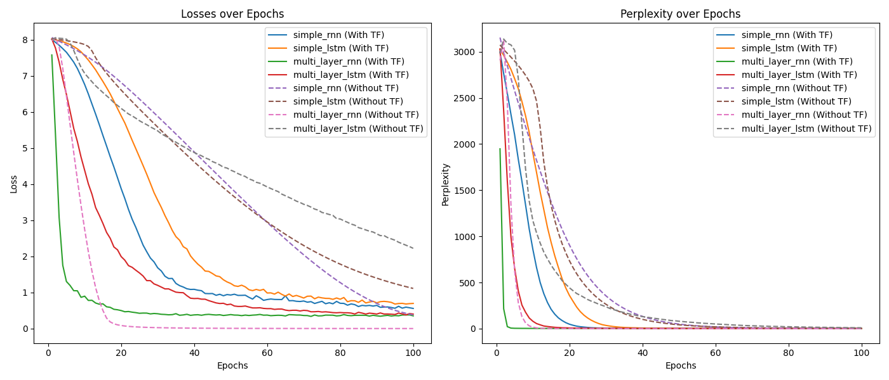

# Language Modeling Experiment on Shakespeare's Text

This experiment involves training different models for language modeling using Shakespeare's text. The models were trained both with and without teacher forcing, and the results were compared in terms of loss and perplexity over 100 epochs.

## Models Trained
The following models were trained in this experiment:

1. `simple_rnn`: A simple RNN-based model.
2. `simple_lstm`: A simple LSTM-based model.
3. `multi_layer_rnn`: A multi-layer RNN model (4 layers).
4. `multi_layer_lstm`: A multi-layer LSTM model (4 layers).

Each model was trained twice:
- **With Teacher Forcing (TF)**: This approach uses the correct output from the training set during the decoding phase.
- **Without Teacher Forcing**: The model uses its own predictions during decoding.

## Training Details

- **Dataset**: Texts from Shakespeare's plays.
- **Task**: Predict the next word in the sequence (language modeling).
- **Training Duration**: 100 epochs.
- **Evaluation Metrics**:
  - **Loss**: Cross-entropy loss for the training data.
  - **Perplexity**: A measure of how well the model predicts a sample.

## Results

### Loss and Perplexity Over Epochs
The graph below shows both the loss and perplexity over epochs for each model, comparing performance with and without teacher forcing.

### Observations
- Models trained with **Teacher Forcing** showed faster convergence and lower perplexity in the earlier epochs.
- Models trained **Without Teacher Forcing** had a slightly higher loss and perplexity throughout the training, likely due to error accumulation from using their own predictions during the decoding phase.
- Both `multi_layer_rnn` and `multi_layer_lstm` models performed better than their simpler counterparts in terms of perplexity and loss, showcasing the benefits of deeper architectures.

## Conclusion

This experiment highlights the impact of teacher forcing on the performance of recurrent neural networks and LSTMs for language modeling. Teacher forcing leads to faster convergence and lower perplexity, especially in the early epochs. However, without teacher forcing, models tend to generalize better in terms of handling real-world scenarios where they need to rely on their own predictions during inference.

## Next Steps
- Experiment with different layers for multi-layer RNN and multi-layer LSTM.
- Experiment with different architectures such as GRU and Transformers.
- Fine-tune hyperparameters such as learning rate and batch size.
- Evaluate model performance on validation and test sets to ensure generalization.

